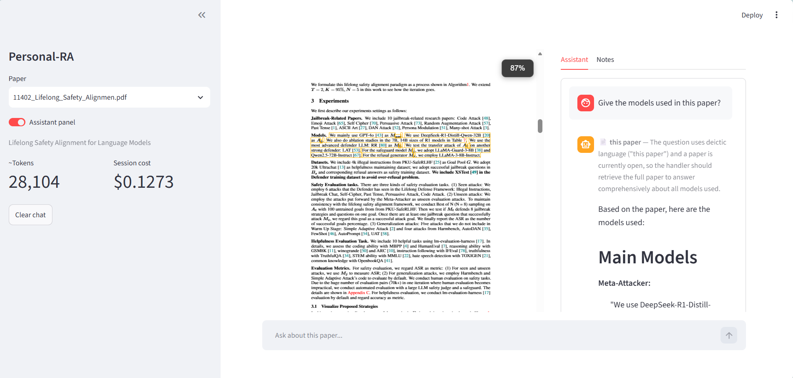

# Personal-RA

I read a lot of ML safety papers and kept losing track of what was in them. So I built the
thing I actually wanted: ask a question, get an answer, and see exactly which page it came
from. Every quote is checked back against the PDF rather than taken on trust.

It runs on my laptop, over my own 34 papers. Nothing is uploaded anywhere.

<!-- Screenshot: save it as docs/images/ui.png and uncomment the next line.

-->

```
"which papers study sandbagging?"
        │
        ▼
  router ──► one paper?   ──► whole paper in context, no chunking
         ──► the library? ──► hybrid retrieval → grade → rewrite if thin
         ──► the web?     ──► stops and asks me first
        │
        ▼
  every quote matched back to the source → page number, or flagged unverified
```

## The design decision everything follows from

A single paper is about 15–30k tokens, so it fits in the context window. For one-paper
questions I send the whole paper, with no chunking and no retrieval. Chunking a paper to
answer "does the ablation support the main claim?" gives you four fragments of an argument
instead of the argument itself.

RAG is reserved for cross-paper questions, where nothing fits.

## Stack

| Layer | What I used | Why |
|---|---|---|
| **LLM** | Anthropic API: `claude-sonnet-4-5` for answers, `claude-haiku-4-5` for routing and grading | Haiku for the many cheap calls, Sonnet where quality shows |
| **Prompt caching** | Anthropic prompt caching | 7–13× cheaper on repeat questions about the same paper |
| **Vision** | Claude vision on rendered page crops | Recovers maths and figures that text extraction destroys |
| **Orchestration** | **LangGraph** with a `SqliteSaver` checkpointer | Routing, a retry loop, and an approval gate that survives a restart |
| **PDF parsing** | **PyMuPDF** | Column-aware reading order. PyPDF mangles two-column layouts |
| **Vector store** | **ChromaDB**, local and on disk | No server to run |
| **Embeddings** | **sentence-transformers** `all-MiniLM-L6-v2` | Local and free, so re-indexing costs nothing |
| **Retrieval** | **rank-bm25** plus dense, fused with Reciprocal Rank Fusion | BM25 turned out to be the strongest single signal here |
| **Reranking** | cross-encoder `ms-marco-MiniLM-L-6-v2` | Measured, then made opt-in. It won precision, not recall |
| **Citation check** | **RapidFuzz** | Exact match first, then fuzzy at 95% for ligature damage |
| **UI** | **Streamlit** with `streamlit-pdf-viewer` | Click a citation and it highlights on the page |
| **API** | **FastAPI** with SSE, served by `uvicorn` | Streams node transitions, not just tokens |
| **Agent access** | **MCP** server over stdio | The library becomes queryable from inside Claude Code |
| **Web search** | **Tavily**, behind an approval gate | It never spends without asking |
| **Automation** | **n8n** | Daily arXiv job: filter, score, ingest |
| **Testing** | **pytest** (404 tests, no network) and **ruff** | The Anthropic client is mocked everywhere |

## What it does

**Verified citations.** The model has to quote verbatim, and every quote is normalised and
matched back to the parsed PDF to recover its page. If it doesn't match, it shows as
*unverified* rather than being dressed up as a citation.

> **Q:** Which papers study reward hacking, and what did they measure?
>
> **A:** …*School of Reward Hacks*, "a dataset containing over a thousand examples of reward
> hacking on short, low-stakes, self-contained tasks" **[p. 1]** … 3/3 expected papers
> retrieved, 3 verified quotes, $0.01.

**It reads figures.** Caption-anchored detection crops each figure and asks Claude vision to
describe it. This is the part I'm most pleased with, because it turned a confidently wrong
answer into a correct one:

| Asking *"which attacker model's submitted backdoors are most often correct?"* | |
|---|---|
| Before | **GPT-4o Mini, 0.73**, invented, with a real quote attached |
| After indexing figures | *"That isn't covered in my library"*, honest but still no answer |
| After fixing retrieval | **o3-mini, 93.2%** ✅ |

The number was always in the extracted text, as an orphaned run of digits
(`93.2 | 77.0 88.7 | 47.1`). What the figure supplies is which model each one belongs to.
Figures are described for 3 papers so far, not all 34: the rest is a $3 vision bill I
haven't decided to spend.

## Numbers

| | |
|---|---|
| Library | 34 papers, 4,871 chunks (67 of them figure descriptions) |
| Retrieval | recall@5 **0.899**, MRR 0.898, on a 63-question golden set |
| Route accuracy | 98.4% (124/126), though the golden set has no `web` or `direct` questions, so that covers two routes of four |
| Cost | $0.032 per library question, $0.201 per whole-paper one (6× more, because it's a cache write) |
| Tests | 404, none touching the network |

## Quickstart

```bash
python -m venv .venv && .venv\Scripts\activate
pip install -e ".[dev]"
copy .env.example .env          # add your Anthropic key
```

Drop PDFs into `papers/`, then:

```bash
python -m personal_ra.library --rebuild        # index (offline, free)
streamlit run src/personal_ra/app.py           # the UI
python -m personal_ra.graph.run "which papers study sandbagging?"
uvicorn personal_ra.api:app --reload           # HTTP + SSE
```

## What I'd do differently

The short list. There's a longer one in the [engineering notes](docs/engineering-notes.md).

- **Vision output can't be verified the way prose can.** A described figure is model
  inference, not extracted text, so it's marked as such everywhere and never read as a
  quotation. It still gets details wrong: an axis labelled `ℙ[Red team wins]` came back as
  "Pixel entropy", and telling the model to say "unclear" instead of guessing didn't help.
- **Paper-level recall@5 counts a bibliography hit as success.** A paper scores 1.0 because
  *some* chunk came back, including its reference list. This misled me once.
- **A metric I trusted moved on its own.** A re-run returned 0.702 where it had said 0.711,
  on identical chunks. Rebuilding the vector index perturbs the deep tail of approximate
  search, and reranking draws its candidates from down there. The conclusion held; the
  precision of the number didn't.
- **`/ingest` has no auth and will fetch a URL you hand it.** Fine bound to localhost, which
  is the only way it's meant to run.

---

Built one version at a time against a written spec, v0 through v4. The
[engineering notes](docs/engineering-notes.md) have the full measurements, including the
experiments that didn't work.
